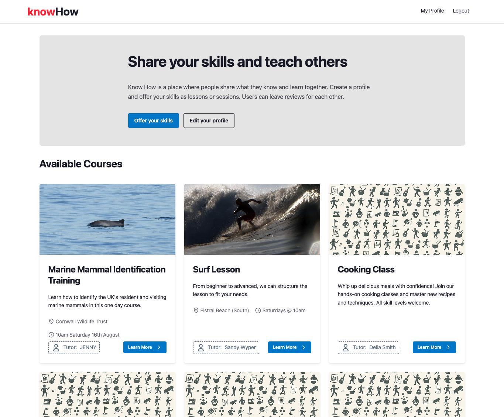
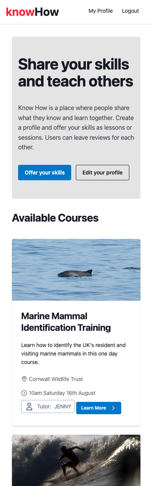
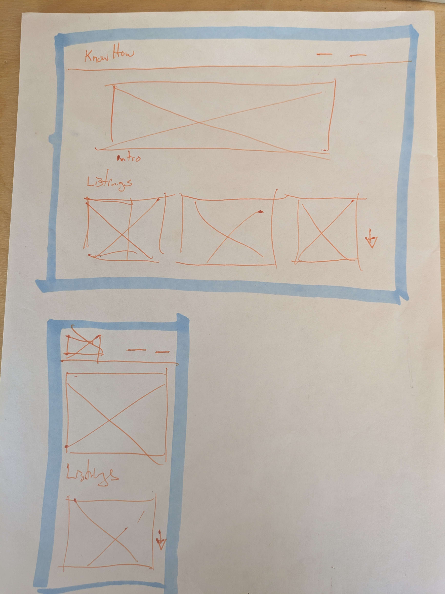
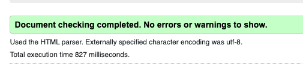
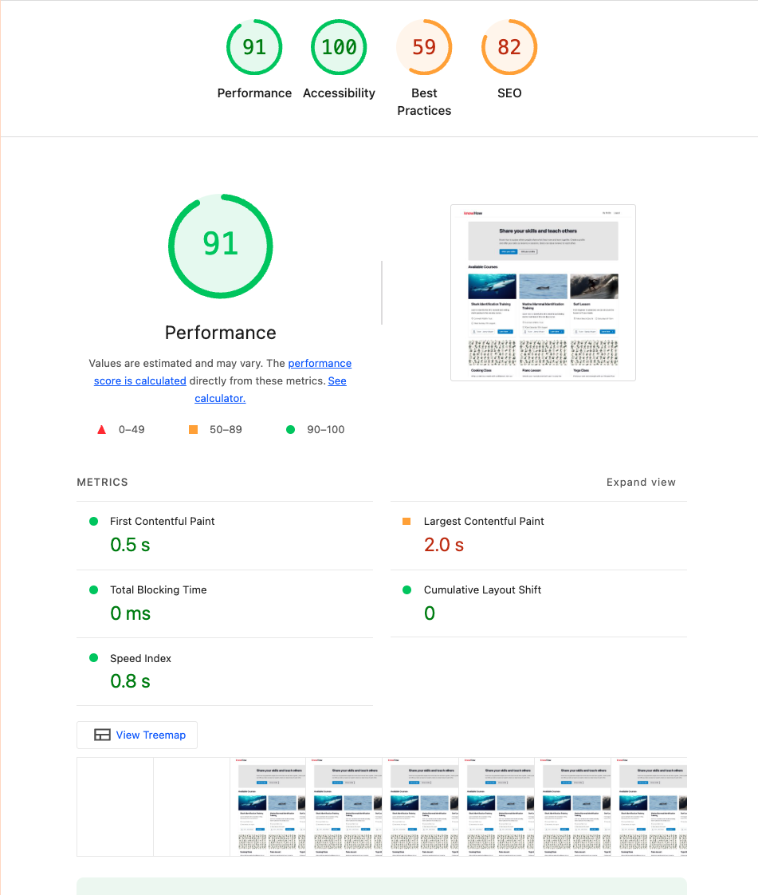

# Know-How

**Know-How** is a skill-sharing platform built with Django that connects people who want to learn with those who want to teach. Users can create profiles, offer their skills through listings, and leave reviews for each other, fostering a community of knowledge sharing and collaborative learning.



## Live Site

The live application is deployed on Heroku: [Know-How Platform](https://know-how-ac9183a9af5a.herokuapp.com/)

## Table of Contents

1. [User Experience (UX)](#user-experience-ux)
2. [Features](#features)
3. [Django Deep Dive](#django-deep-dive)
4. [Design](#design)
5. [Testing](#testing)
6. [Deployment](#deployment)
7. [Technologies Used](#technologies-used)
8. [Credits](#credits)

## User Experience (UX)

### Project Goals

Know-How aims to create a platform where knowledge sharing is accessible, organized, and community-driven. The platform enables users to:

- Share their expertise through structured listings
- Find learning opportunities in various subjects
- Build trust through a review system
- Create detailed profiles showcasing their skills and experience

### User Stories

#### As a Visitor

- I want to browse available skills and courses without needing to register
- I want to see tutor profiles and their ratings to make informed decisions
- I want to easily understand what the platform offers

#### As a Registered User

- I want to create and manage my profile with professional information
- I want to create listings to offer my skills and expertise
- I want to leave reviews for tutors I've learned from
- I want to edit and update my listings and profile information

#### As a Tutor

- I want to showcase my expertise through detailed listings
- I want to manage my course offerings (draft/publish)
- I want to receive feedback through the review system
- I want to build my reputation on the platform

## Features

### Core Features

#### 1. User Authentication & Profiles

- **User Registration/Login**: Secure authentication using Django Allauth
- **Profile Management**: Comprehensive user profiles with:
  - Bio and location information
  - Professional expertise areas
  - Years of experience
  - Education and certifications
  - Profile images via Cloudinary
  - Average rating display based on reviews

#### 2. Skill Listings System

- **Create Listings**: Tutors can create detailed course/skill offerings
- **Rich Content**: Support for detailed descriptions using Django Summernote
- **Image Upload**: Course images stored via Cloudinary
- **Draft/Publish System**: Control over listing visibility
- **Location & Timing**: Flexible session information

#### 3. Review System

- **Peer Reviews**: Users can review tutors they've learned from
- **Rating System**: 1-10 rating scale with detailed feedback
- **One Review Per Tutor**: Prevents spam with unique constraints
- **Review Display**: Average ratings calculated and displayed on profiles

#### 4. Responsive Design

- **Mobile-First**: Optimized for all device sizes
- **Modern UI**: Clean, professional interface using Tailwind CSS
- **Accessibility**: Semantic HTML and proper ARIA labels



### Features Left to Implement

- **Booking System**: Direct booking functionality for sessions
- **Messaging**: Private communication between users
- **Categories/Tags**: Better organization of skills and subjects
- **Search & Filter**: Advanced filtering options for listings
- **Payment Integration**: Monetization features for tutors
- **Calendar Integration**: Schedule management for sessions

## Django Deep Dive

### Models

The application is built around four main models:

#### User Profile Model

```python
class UserProfile(models.Model):
    user = models.OneToOneField(User, on_delete=models.CASCADE)
    bio = models.TextField(max_length=500, blank=True)
    location = models.CharField(max_length=100, blank=True)
    profile_image = CloudinaryField('image', default='placeholder')
    expertise_areas = models.TextField(blank=True)
    years_experience = models.PositiveIntegerField(null=True, blank=True)
    education_and_certifications = models.TextField(blank=True)
```

#### Listing Model

```python
class Listing(models.Model):
    title = models.CharField(max_length=100)
    short_description = models.TextField(blank=True)
    slug = models.SlugField(max_length=200, unique=True)
    tutor = models.ForeignKey(User, on_delete=models.CASCADE)
    content = models.TextField()
    location = models.CharField(max_length=200, blank=True)
    session_time = models.CharField(max_length=100, blank=True)
    image = CloudinaryField('image', default='placeholder')
    status = models.IntegerField(choices=STATUS, default=0)
```

#### Review Model

```python
class Review(models.Model):
    target_user = models.ForeignKey(User, on_delete=models.CASCADE, related_name='reviews_received')
    author = models.ForeignKey(User, on_delete=models.CASCADE, related_name='reviews_written')
    rating = models.PositiveIntegerField(validators=[MinValueValidator(1), MaxValueValidator(10)])
    title = models.CharField(max_length=100)
    body = models.TextField()
```

### Views

#### Class-Based Views

- **ListingList**: Displays paginated published listings
- **ListingCreateView**: Handles new listing creation (authenticated users only)
- **ListingUpdateView**: Allows listing owners to edit their content
- **ProfileView**: Displays user profiles with reviews and listings

#### Function-Based Views

- **listing_detail**: Shows individual listings with permission checks
- **publish_listing**: Toggles listing status from draft to published

### Templates

The application uses a comprehensive template structure:

- **base.html**: Main layout with navigation, messages, and footer
- **listings/**: Templates for listing display, creation, and management
- **profiles/**: User profile display and editing templates
- **reviews/**: Review creation and editing interfaces
- **account/**: Authentication templates (login, signup, etc.)

## Design

### Wireframes

The initial design and layout planning was done through hand-drawn wireframes to establish the core user interface structure and user flow:


_Initial wireframe sketches showing main page layouts and navigation structure_


_Detailed wireframes for user profiles, listings, and review system_

These wireframes helped establish the foundation for the responsive design and ensured a user-centered approach to the interface development.

### Color Scheme

The design follows a professional, accessible color palette:

- **Primary**: Red (#ef4444) for brand elements and CTAs
- **Base**: Clean whites and grays for content areas
- **Secondary**: Subtle grays for supporting elements
- **Success/Error**: Standard green/red for system messages

### Typography

- **Headers**: Bold, clear typography for readability
- **Body Text**: Clean, readable fonts optimized for long-form content
- **UI Elements**: Consistent styling across buttons and forms

### Layout Philosophy

- **Mobile-First**: Responsive design starting with mobile optimization
- **Card-Based**: Clean card layouts for listings and profiles
- **Whitespace**: Generous spacing for visual clarity
- **Consistency**: Uniform styling across all pages

## Testing

### Manual Testing

The application has been thoroughly tested across:

- **Browsers**: Chrome, Firefox, Safari, Edge
- **Devices**: Desktop, tablet, and mobile viewports
- **User Flows**: Registration, listing creation, profile management, reviews

### Unit Testing

The application includes automated testing focused on form validation:

#### Form Testing

- **ListingForm**: Comprehensive validation testing including:
  - Valid form submission with all fields
  - Minimum required fields validation
  - Field-specific validation (title, content, status)
  - Image upload handling
  - Invalid data handling and error messages
- **Edge Cases**: Empty forms, invalid data types, and boundary conditions

### Code Quality & Performance

#### HTML Validation

All templates have been validated using the W3C HTML validator to ensure standards compliance:


_W3C HTML validation showing clean, error-free markup_

#### Lighthouse Performance

The application achieves excellent performance scores across key metrics:


_Lighthouse audit showing strong performance, accessibility, and SEO scores_

#### Standards Compliance

- **PEP 8 Compliance**: Python code follows standard conventions
- **CSS Validation**: Styles validated for standards compliance
- **Accessibility**: WCAG guidelines followed for inclusive design
- **SEO Optimization**: Meta tags and semantic HTML for search engine visibility

## Deployment

### Heroku Deployment

The application is deployed on Heroku with the following configuration:

1. **Environment Variables**:

   - `SECRET_KEY`: Django secret key
   - `DATABASE_URL`: PostgreSQL database connection
   - `CLOUDINARY_URL`: Media storage configuration
   - `DEBUG`: Set to False in production

2. **Build Process**:

   - Automatic deployment from main branch
   - Static files served via WhiteNoise
   - Media files handled by Cloudinary

3. **Database**: PostgreSQL database for production
4. **Static Files**: Collected and served efficiently
5. **Media Storage**: Cloudinary integration for images

### Local Development

To run locally:

```bash
# Clone the repository
git clone [repository-url]

# Install dependencies
pip install -r requirements.txt

# Set up environment variables
# Create env.py with required settings

# Run migrations
python manage.py migrate

# Create superuser
python manage.py createsuperuser

# Run development server
python manage.py runserver
# or to run with tailwind/daisyUI
python manage.py tailwind dev
```

## Technologies Used

### Backend

- **Django 4.2.23**: Web framework
- **Python 3.x**: Programming language
- **PostgreSQL**: Production database
- **SQLite**: Development database

### Frontend

- **HTML5**: Semantic markup
- **CSS3**: Styling and layout
- **JavaScript**: Interactive functionality
- **Tailwind CSS**: Utility-first CSS framework
- **DaisyUI**: An extension for tailwind for UI styling

### Third-Party Services

- **Django Allauth**: Authentication system
- **Cloudinary**: Image storage and optimization
- **Django Summernote**: Rich text editing
- **Crispy Forms**: Form rendering with Tailwind
- **WhiteNoise**: Static file serving

### Development Tools

- **Django Debug Toolbar**: Development debugging
- **Django Browser Reload**: Hot reloading in development
- **Gunicorn**: WSGI server for production
- **Heroku**: Cloud platform deployment

## Credits

### Development

This project was developed as part of a Code Institute full-stack development learning journey, implementing modern web development practices and Django best practices.

### Inspiration

The platform draws inspiration from:

- AirBnB
- Skill-sharing communities
- Professional networking sites

---

**Know-How** - _Connecting learners with teachers, one skill at a time._
